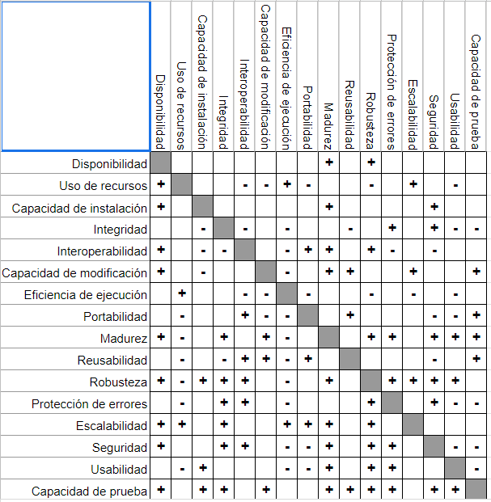

# CURSO PROFESIONAL DE ARQUITECTURA DE SOFTWARE

## *Atributos de Calidad*

Cualidades de un sistema, son espectativas implícitas o explicítas de un sistema que tiene un usuario sobre un atributo.

### Idoneidad Funcional

Completitud: Cuan completa está la implementación.

        Requerimientos funcionales / funcionalidades implementadas

Exactitud Funcional: Cuan preciso es el sistema

        Resultado esperado / resultado obtenido

Pertinencia: Que tan alineado está lo que se implementó con lo que se solicitó.

        Objetivos cumplidos / objetivos esperados

### Eficiencia de ejecución

- **Tiempo a Comportamiento**: Tiempo transcurrido entre petición y una respuesta
- **Uso de recursos**: Consumo de recursos y consumo esperado o tolerado
- **Capacidad**: Cuanto soporta el sistema en concurrencia. Límite de tolerancia detectado / Límite de tolerancia esperado

### Compatibilidad

- **Interoperabilidad**: Que tan fácil se comunica el sistema con otros sistemas
- **Coexistencia**: Que tanto el sistema puede convivir con otros sistemas sin que se generen errores.

### Usabilidad

- **Reconocimiento de Idoneidad**: Relación entre conceptos de dominio y acciones del sistema
- **Curva de aprendizaje**: La facilidad para aprender a usarlo. Está relacioanda con que tan intuitivo es.

- **Operabilidad**: Esfuerzo para cumplir un objetivo. Se recomienda no utilizar formularios tan largos.

- **Protección a errores**: Información al usuarios de los errores que ha cometido. Se mide en el número de veces en las que el usuario intenta hacer algo y cuantas veces falla el sistema.

- **Estética de la interfaz**:

- **Accesibilidad**: ¿Las personas con algún tipo de discapacidad pueden utilizar el sistema?

### Confiabilidad

- **Madurez**: Cuantos errores genera. Se mide por el tiempo transcurrido entre un error y otro. Entre más tiempo pase entre uno y otro error, se dice que es más maduro.

- **Disponibilidad**: Cuanto tiempo dura el sistema fuera de servicio.

- **Tolerancia a Fallos o Resilencia**: Como el sistema sigue funcionando aún si se presentan errores. *Chaos Testing*

- **Capacidad de recuperación**: Tiempo medio para la recuperación. Cuaanto demora el sistema para recuperar después de haber estado no disponible.

### Seguridad

Se mide con penetration testing

- **Confidencialidad**:

- **Traza de responsabilidad**:Log de auditoría.

- **Integridad**:

- **Comprobación de hechos**: Firmas digitales, log de auditoría.

- **Autenticidad**: Como el sistema identifica al usuario

### Mantenibilidad

Las cosas que hacen que un sistema pueda cambiar, o se puedan corregir los errores. Buena convertura de código y análisis estático de código.

- **Modularidad**: Independencia entre módulos
- **Reusabilidad**: Reutilizar piezas de software en diferentes contextos.
- **Capacidad de análisis**: Que tan rápido se puede entender el código.
- **Capacidad de modificación**: Que tan fácil es modificar el código sin afectar otras funcionalidades. Test automatizados.

- **Capacidad de prueba**: Que tan fácil es crear los test. Diseñar objetos puros que no tengan efectos colaterales, que puedan ejecutarse en diferentes momentos de tiempo.

### Portabilidad

- **Adaptabilidad**:
- **Capacidad de instalación**: Se mide analizando los requerimientos del entorno del desplieguue, cuantos pasos y que tan complejos son para desplegar la aplicación.
- **Capacidad de reemplazo**: Como cumplen los requerimientos los sistemas actuales.

## *Tensiones entre Atributos*

La siguiente imagen muestra como si se le da prioridad a un atributo, se puede estar perdiendo entro 

## *Patrones de Arquitectura*

Son decisiones de diseño

### Patrones monolíticos

Todos los artefactos de un sistema se desplegan como una sola unidadd.

- **Gran bola de lodo**

Todas las partes de un sistema se comunican con todas. Un sistema con esta arquitectura, es un sistema que genera caos. Requiere una gran inversión para poder migrar esta arquitectura.

- **Modelo Vista Controlador**
1. MVC
2. MVVM
3. Flux

**Arquitectura de Capas**

Aplicación - Dominio - Datos. La comunicación entre capas, debe ser de arriba hacia abajo. Se implementa en un monolito. Tiene ventajas de mantenibilidad.

**Arquitectura Orientada a eventos**

Permite conectar eventos a través de eventos. Existe un bus de evntos que es el encargado exclusivamente de la comunicación. Esta arquitectura presenta varios desafíos, y es que la lectura del estado actual del sistema; cada vez será más difícil. El componente debe estar suscrito al evento para poder comunicarse con los otros eventos.

**Comparte Nada**

Permite aprovechar al máximo los recursos que se tienen disponibles

**Microservicios**

Componentes distribuídos del sistema, donde cada componente expone una funcionalidad al resto del sistema. Se modulariza el sistema. Cada uno de los microservicios, tiene una base de datos independiente.

Puede existir comunicación directa o através de un bus de eventos. Puede ser costoso de mantener para grupos o empresas pequeñas de software.

**CQRS**

Define la separación entre consultas y comandos.

## *Diseño Orientado al dominio*

Más que una arquitectura, se guía el diseño de la aplicación a través del uso del lenguaje común entre el negocio y el desarrollo. Se busca modularizar el sistema a través de contextos delimitados, donde el lenguaje cambia. Hay mucho valor en la semántica.

## *Tipos de conectos*

- Llamado a procedimiento: Invocan de un componente a otro componente

- Enlace

- Evento: Permiten a un componente notificar que algo sucedió

- Adaptador: Interconectar componentes que no están diseñados para trabajar juntos.

- Acceso a Datos

- Flujo

- Arbitraje: Como se coordinan los componentes para el acceso a los recursos.

- Distribudor: Pasar un mensaje a distintos componentes