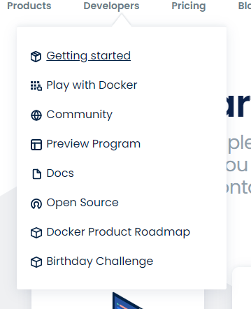
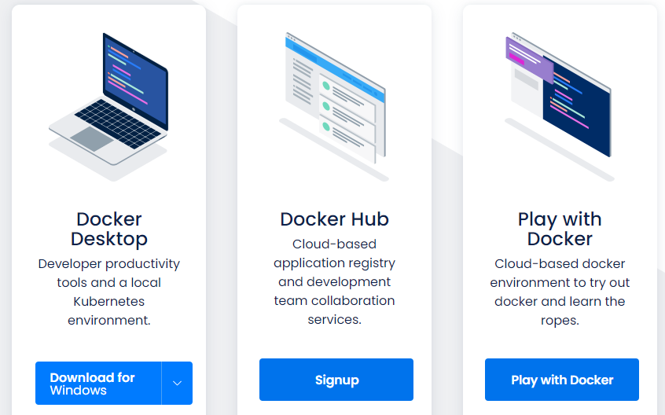
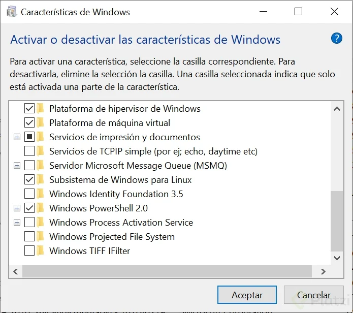

__PROBLEMAS AL CONSTRUIR SOFTWARE__
=

1. Entorno de Desarrollo
2. Dependencias
3. Entorno de Ejecución
4. Equivalencia con entorno productivo
5. Servicios externos
6. Distribuir Software
    
    a. Divergencia de repositorios
    b. Divergencia de artefactos
    c. Versionado

7. Ejecutar Software

    a. Compatibilidad con el entorno productivo
    b. Dependencias
    c. Disponibilidad de servicios externos
    d. Recursos de hardware

> Docker permite construir, distribuir y ejecutar cualquier aplicación en cualquier lado

---

__VIRTUALIZACIÓN__
=

Permite atacar en simultáneo los tres problemas del desarrollo de software

## Máquinas virtuales

Las máquinas virtuales tienen varios problemas. 

1. _Peso_: En el orden de los GB's. Repiten archivos en común 
2. _Costo de Administración_: Necesita mantenimiento igual que cualquier otra computadora.
3. _Múltiples formatos_

Docker es una alternativa a las máquinas virtuales, puesto que usa contenedores.

Los contenedores son:
1. flexibles
2. Son livianos, porque reutilizan el kernel del sistema operativo
3. Son portables: Se ejecutan de la misma manera en cualquier sistema
4. Tienen bajo acoplamiento
5. Son escalables
6. Seguros

---

__INSTALACIÓN DE DOCKER__
=

Lo primero es ir al [Sitio web de Docker](https://www.docker.com/) y seleccionar la opción **Get Started** menú **Developers**

Después debemos seleccionar la opción **Docker Desktop** 

y descargamos la versión de acuerdo con el sistema operativo instalado, aunque por defecto él la reconoce.

También deberemos tener una cuenta creada en **Docker Hub**

Docker se ejecuta de manera nativa sobre Linux, para ejecutarlo sobre otro S.O, se virtualiza.

Para un entorno de Windows, se deben seguir los siguientes pasos adicionales:

1. Habilitar en las herramientas de Windows, las siguientes opciones.

2. Seguir las instrucciones de este [enlace](https://docs.microsoft.com/es-es/windows/wsl/install-win10#step-4---download-the-linux-kernel-update-package)

Una vez ya tenemos todo instalado y configurado, verificamos la instalación de docker con los siguientes comandos en una terminal de nuestro sistema operativo

    docker --version

    docker info

---

__QUE ES DOCKER Y COMO FUNCIONA__
=

Todo se ejecuta en una base que es el **Docker daemon** es un servicio entre las aplicaciones y el sistema operativo. La comunicación a este servicio, se hace a través de una API REST.

Los contenedores se ejecutan en una capa superior al servicio. Estos son los que nos permitirán ejecutar las aplicaciones. 

Un contenedor es una unidad lógica, puede correr de manera nativa en la máquina anfitriona. Es segura porque es limitada en cuanto a acceder a los recursos de la máquina hospedadora.

---

__EJECUTANDO CONTENEDORES__
=

Para ejecutar un contenedor, utilizamos el comando: **docker run** para nuestro ejemplo:

    > docker run hello-world

Cada vez que se ejecuta el comando, se crea un nuevo contenedor

Con el comando **docker ps** se pueden ver todos los contenedores que se están ejecutando, pero con **docker ps -a** se muestran todos los contenedores

Con el comando **docker inspect <id del contenedor>** podemos revisar la configuración del contenedor con el id ingresado. Sin embargo, este último comando también recibe el nombre del contenedor como parámetro **docker inspect <nombre del contenedor>**

Para crear un contenedor a partir de uno existente pero con un nombre customizado, ejecutamos el siguiente comando.

    > docker run --name <nombre_nuevo> <nombre_existente>

Para eliminar un contenedor, utilizamos el siguiente comando

    > docker rm <id del contenedor> o <nombre del contenedor>

Sin embargo, si existen muchos contenedores creados, con el comando anterior se hace dispendioso borrar 1 a 1. Para hacer esto de forma más eficiente, se tiene el comando **docker container prune** este comando, elimina todos los contenedores que se encuentran detenidos.

Docker nos da la facilidad de ejecutar un linux dentro de un contenedor, para nuestro ejercicio, ejecutamos el comando:

    > docker run ubuntu

Sin embargo, al ejecutar el comando anterior, docker descarga la imagen de ubuntu, pero no la ejecuta, por lo que debemos ejecutar en modo interactivo para poder interactuar con nuestro ubuntu, para ello, debemos agregar al comando anterior el parametro -it

    > docker run -it ubuntu

Con este comando, ya ejecutamos la consola de ubuntu dentro de un contenedor. Para comprobar que si estamos en una distribución Linux, podemos ejecutar el comando

    > cat /etc/lsb-release

---
__CICLO DE VIDA DE LOS CONTENEDORES__
=

Un contenedor se apaga, cuando su proceso principal hace exit.
Con el siguiente comando, podemos ejecutar un contenedor en un segundo plano.

    > docker run -name <nombre> -d <nombre del contenedor existente> tail -f /dev/null #/dev/null indica el comando que quiero ejecutar

Con el comando **docker ps** podemos verificar que el anterior comando está ejecutando un contenedor.

Con el comando **docker exec -it alwaysup bash**. En este caso "alwaysup" es el nombre del contenedor que asignamos, para identificarlo fácilmente.

Para detener un contenedor que está ejecutando en segundo plano, ejecutamos el siguiente comando.

    > docker inspect --format '{{.State.Pid}}' alwaysup

Este comando nos mostrará el Id process que se está ejecutando en el S.O nativo para poderlo detener.

Para detener el proceso principal de un contenedor en Linux, utilizamos el comando

    > kill //id del proceso, que fue mostrado con el comando anterior

    >docker stop \nombre contenedor\
    
El anterior comando detiene el contenedor del nombre indicado

    > docker run -d --name proxy -p 8080:80 nginx
Ejecuta un servidor nginx donde el puerto del contenedor que recibe las peticioes es el puerto 80 y el puerto de la máquina anfitriona es el puerto 8080

    >docker logs proxy

Permite ver los logs del contenedor con nombre proxy, sin embargo se le debe colocar el parámetro -f para que se pueda ver de forma continúa.

    >docker logs -f proxy

Para ver un número de líneas definido, se utiliza el siguiente comando

    >docker logs --tail 10 -f proxy

En el ejemplo anterior, se indica que se quieren ver las 10 últimas líneas del log del contenedor llamado proxy

___
__BIND MOUNTS__
=
Para ejecutar un contenedor de mongoDB

    >docker run -d --name db mongo

El ejemplo anterior ejecuta un contenedor de mongoDB llamado db. Sin embargo, el comando anterior, no guarda los datos de forma persistente cuando el contenedor es eliminado.

Para relacionar una ruta de la máquina anfitriona en un contenedor, lo hacemos de la siguiente forma.

    >docker run -d --name db -v ruta_maquina anfitriona:/data/db mongo

De esta forma se mantienen de manera persistente los datos aún si se pierde el contenedor.

---
__VOLÚMENES__
=

Los volúmenes brindan un poco más seguridad que los bind mounts en ambiente productivo.

    >docker volumen ls

Con el comando anterior se pueden visualizar las operaciones que se pueden visualizar sobre los volúmenes.

Para crear un volumen, utilizamos el siguiente comando:

    >docker volume create dbdata

Se crea un volumen con el nombre dbdata. 

    >docker run -d --name db --mount src=dbdata,dst=/data/db mongo

Con el comando anterior se crea un contenedor con el volumen creado previamente llamado **dbdata** y en la ruta destino donde mongo guarda los datos en el contenedor.

La diferencia con los volúmenes, es que docker administra los archivos y no se sabe la ruta donde estos están. Esta es otra forma de persistir datos y más segura que **bind mounts**

---
__INSERTAR O EXTRAER ARCHIVOS DE UN CONTENEDOR__
=

## Insertar un archivo ##

Para insertar un archivo en un contenedor utilizamos el siguiente comando:

    >docker cp ruta_archivo contenedor:ruta Contenedor/nombre archivo

## Para extraer un archivo ##

Para extraer un archivo de un contenedor ejecutamos el siguiente comando

    >docker cp contenedor:ruta_contenedor ruta_anfitriona

---
__IMÁGENES__
=

Contiene todo lo necesario para que un contenedor pueda ejecutarse.

    >docker image ls

Lista todas las imágenes que se encuentran almacenadas de forma local

De la siguiente página se pueden descargar la diferentes imágenes [Docker Hub](https://hub.docker.com/)

Para obtener una imagen se utiliza el siguiente comando

    >docker pull nombre_imagen

El nombre de la imagen corresponden al nombre de la imagen en docker hub o el repositorio del que se desee descargar la imagen.
Por defecto, docker obtiene las imágenes del hub.docker

Para crear una imagen, primero debemos tener instalado el paquete touch-cli, para ello, ejecutamos el siguiente comando.

    >npm install touch-cli -g

Para crear una imagen, primero se debe crear un archivo llamado DockerFile con el comando touch.

    >touch Dockerfile

Todo lo que se escriba en el archivo Dockerfile, se ejecuta en el tiempo del build. El Archivo, Dockerfield siempre debe partir de una base, para el ejemplo este arrancará de un imagen de Ubuntu.

Nuestro Dockerfile queda de la siguiente forma

    >FROM ubuntu:latest

    RUN touch /usr/src/hola-platzi.txt

Después compilamos el archivo Dockerfile para generar la imagen con el siguiente comando.

    >docker build -t ubuntu:jaime .

El **-t** indica que le vamos a asignar un tag, este tag es ubuntu pero con el nombre jaime y el punto indica que tiene acceso a la ruta actual.

Todas las imágenes son un conjunto de capas o layers. Después para utilizar la imagen creada, lo hacemos igual que ejecutar un contenedor.

    >docker run .... ubuntu:jaime

Con el siguiente comando, publicamos la imagen creada, pero antes debemos ingresar a docker hub con las credeciales previamente creadas para poderla publicar, además debemos reasignar el tag a la imagen para indicar que la vamos a publicar en el repositorio personal. Para hacer esto lo hacemos de la siguiente manera

    >docker tag ubuntu:jaime jaefallac/ubuntu:jaime

Con el comando anterior retaguemos la imagen. Después de esto ya se puede publicar en el repositorio donde tengamos permisos para publicar la imagen.

    >docker push jafallac/ubuntu:jaime

Con el comando

    >docker history ubuntu:jaime

Podemos ver las capas que componente la imagen.

Una herramienta para poder ver el dockerfile de una imagen se llama [dive](https://github.com/wagoodman/dive)

El comando **commit** casi no se usa

---
__COMUNICACIÓN ENTRE CONTENEDORES__
=

Para consultar las redes existentes de docker

    >docker network ls

Para crear una red

    >docker network create nombre_red

Si quiero que otros contenedores se conecten a esa red, agrego el atributo **--attachable**

    >docker network create --attachable nombre_red

Para ver la configuración de la red

    >docker network inspect nombre_red

Para conectar un contenedor a una red

    >docker network connect nombre_red nombre_contenedor

Para crear una variable de entorno del contenedor

    >docker run -d --name app -p 3000:3000 --env MONGO_URL=mongodb://db:27017/test platziapp

Con el comando anterior se crea un contenedor basado en la imagne previamente creada llamada **platziapp** la cual es expuessta por el puerto 3000 del contenedor y se quiere que se conecte por el puerto 3000 de la máquina anfitriona. Para declarar la variable de entorno se agrega el parámetro **--env** en este caso la variable de entorno queremos que se llame **MONGO_URL** indicando que es de un contenedor mongodb que se llama db y responde por el puerto **27017** y se conecta a la base de datos **test**

---
__DOCKER COMPOSE__
=

Para que docker compose funcione, se debe tener el archivo docker-compose.yml construído. Una vez se tiene construído, desde la consola de comandos debemos ubicarnos en la carpeta donde se encuentra y ejecutar el siguiente comando

    >docker-compose up

Si queremos que la consola no quedé atachada a la ejecución de los contenedores, agregamos el parámetro **-d**

    >docker-compose up -d

Docker compose trabaja directamente con servicios y no con containers.

    >docker-compose logs

Para ver los logs de los contenedores creados por el archivo de docker compose.

    >docker-compose logs nombre_contenedor

    >docker-compose down

Para destruir todo lo construído por docker compose

Cuando trabajamos en un entorno colaborativo, se debe crear un archivo llamado **docker-compose.override.yml** para configurar el entorno local sin ir a afectar el archivo **docker-compose.yml** que corresponde al entorno colaborativo.

Este archivo funciona como un hijo del archivo original, docker-compose lo que intenta es combinarlos al momento de levantar la configuración con el comando **up**

---
__ADMINISTRANDO LOS CONTENEDORES__
=

Eliminar todos los contenedores tanto los que se están ejecutando y los detenidos

    >docker rm -f $(docker ps -aq)

Para eliminar todo lo que está detenido

    >docker system prune

Para limitar la memoria del contenedor agregamos el parámetro **--memory**

    >docker run -d --name app --memory 1g platziapp

El ejemplo anterior crea un contenedor de la imagen platziapp con el nombre app con una memoria de hasta 1GB. El contenedor no utilizará más de esa memoria.

    >docker stats

Con el comando anterior se visualiza los recursos de la máquina anfitriona que están utilizando los contenedores.

    >docker ps -l

El anterior comando muestra el último proceso ejecutado esté o no ejecutándose.

Cuando se ejecuta el comando **stop** docker envía una seña al proceso de **term** si el proceso no responde después de determinado tiempo, envía la señal de **kill**. También se puede ejecutar este último de manera directa.

    >docker kill nombre_contenedor

Otra cosa importante que se debe tener en cuenta es cuando queremos ejecutar un comando como el proceso principal del contenedor. Se debe tener claro cual es la diferencia entre **shell form y exec form**. El primero, ejecuta el proceso, como un proceso hijo de la consola shell, el segundo como el proceso principal.

    FROM ubuntu:trusty
    COPY ["loop.sh", "/"]
    CMD /loop.sh

Para el ejemplo, la capa del CMD, ejecuta el archivo **loop.sh** como un proceso hijo. si lo escribimos entre "[]", indicamos a docker que lo ejecute como proceso principal.

    CMD[/loop.sh]

Al ejecutarlo como proceso hijo, shell no le pasa el mensaje de term o la señal que envía docker de detenerse a los hijos.

Para ver los procesos que tiene un contenedor, lo hacemos con el siguiente comando.

    >docker exec nombre_contenedor ps -ef

Para consultar y eliminar las imágenes colgantes

    >docker images -q --no-trunc -f dangling=true | xargs docker rmi

---
__DOCKER IN DOCKER__
=

Dentro de un contenedor podemos ejecutar comandos docker haciendo uso del archivo socket que nos provee docker para ello. Para hacer esto, ejecutamos el siguiente comando.

    >docker run -it --rm -v /var/run/docker.sock:/var/run/docker.sock docker:latest

El comando anterior referencia el archivo docker.sock en la máquina anfitriona en la ruta del contenedor. Con esto, ya podemos ejecutar comandos docker dentro de un contenedor.

    >docker plugin install nombre_plugin